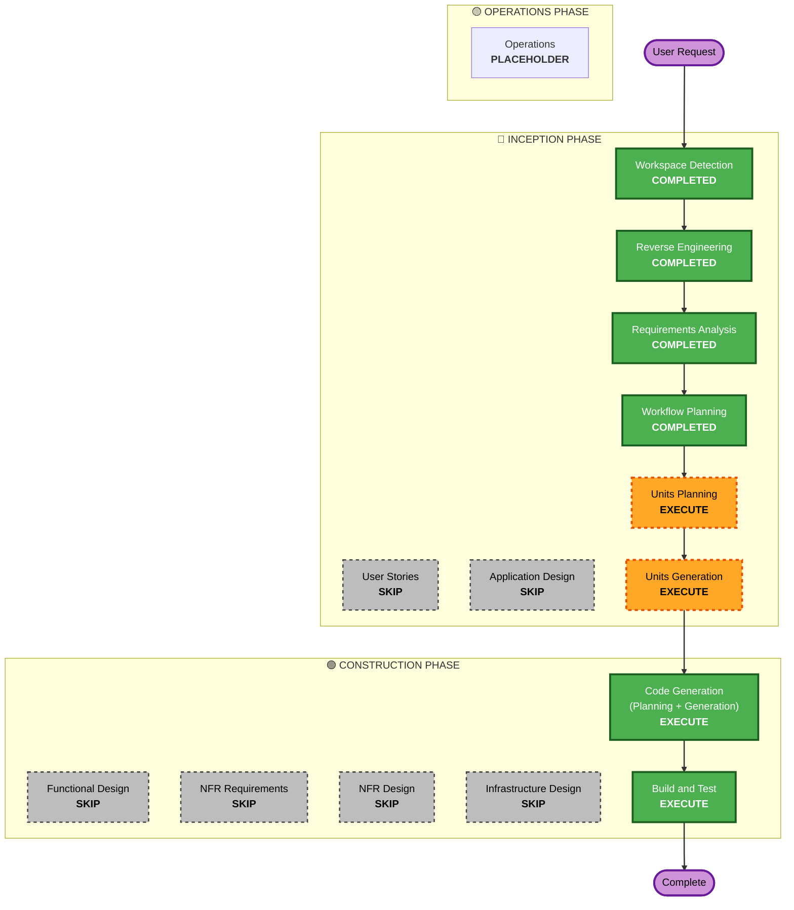

# Execution Plan

## Detailed Analysis Summary

### Transformation Scope (Brownfield Only)
- **Transformation Type**: Component Extension (Adding new tools to existing MCP server)
- **Primary Changes**: 
  - `src/api-client.ts` の拡張（新しいエンドポイントの追加）
  - `src/types.ts` の拡張（新しいデータ型の追加）
  - `src/tools/` への新しいツール群の追加（`audit-logs`, `duplicates`, `deletion-requests`, `tokens`, `users` など）
  - `src/index.ts` へのツール登録
- **Related Components**: 
  - `saga-event-space-worker` のAPI仕様

### Change Impact Assessment
- **User-facing changes**: Yes (MCPサーバーを通じて新しいツールがAIから利用可能になる)
- **Structural changes**: No (既存のアーキテクチャパターンを踏襲)
- **Data model changes**: Yes (既存の `src/types.ts` に新しいモデル定義を追加)
- **API changes**: Yes (MCPクライアント側での呼び出し先エンドポイントの追加)
- **NFR impact**: No

### Component Relationships
```markdown
## Component Relationships
- **Primary Component**: `src/tools/*` (新規および既存ツール)
- **Shared Components**: `src/api-client.ts` (API通信), `src/types.ts` (型定義)
- **Dependent Components**: `@modelcontextprotocol/sdk`
```

### Risk Assessment
- **Risk Level**: Low
- **Rollback Complexity**: Easy (Gitリバートで対応可能)
- **Testing Complexity**: Simple (MCPクライアントでの動作確認)

## Workflow Visualization



## Phases to Execute

### 🔵 INCEPTION PHASE
- [x] Workspace Detection (COMPLETED)
- [x] Reverse Engineering (COMPLETED)
- [x] Requirements Analysis (COMPLETED)
- [x] User Stories (SKIPPED)
  - **Rationale**: 内部的なAPIクライアントとツールの追加であり、複雑なユーザーペルソナの定義は不要。
- [x] Execution Plan (COMPLETED)
- [ ] Application Design - SKIP
  - **Rationale**: 既存のMCPサーバーアーキテクチャに新しいツールを追加するだけであり、新しいサービスレイヤーやコンポーネント間連携の設計は不要。
- [ ] Units Planning - EXECUTE
  - **Rationale**: どのAPIエンドポイントをどのツールファイルに分割するか（例: `audit-logs.ts`, `duplicates.ts` など）を整理する必要がある。
- [ ] Units Generation - EXECUTE
  - **Rationale**: 整理した単位（Unit）をもとに、実装タスクを生成する必要がある。

### 🟢 CONSTRUCTION PHASE
- [ ] Functional Design - SKIP
  - **Rationale**: MCPツールからAPIクライアントへのマッピングという単純なロジックであり、複雑なビジネスルールの設計は不要。
- [ ] NFR Requirements - SKIP
  - **Rationale**: 既存のNFRで十分であり、新たな非機能要件はない。
- [ ] NFR Design - SKIP
  - **Rationale**: NFR Requirementsがないためスキップ。
- [ ] Infrastructure Design - SKIP
  - **Rationale**: インフラストラクチャの変更は伴わないためスキップ。
- [ ] Code Generation - EXECUTE (ALWAYS)
  - **Rationale**: 実際のコード（ツール定義、型定義、APIクライアント）の生成が必要。
- [ ] Build and Test - EXECUTE (ALWAYS)
  - **Rationale**: TypeScriptのビルドエラーがないかの確認、および動作確認が必要。

### 🟡 OPERATIONS PHASE
- [ ] Operations - PLACEHOLDER
  - **Rationale**: デプロイメントに関するタスクはスコープ外。

## Estimated Timeline
- **Total Phases**: 4 (Units Planning, Units Generation, Code Generation, Build and Test)
- **Estimated Duration**: 15 - 30 minutes

## Success Criteria
- **Primary Goal**: MCPサーバーが `saga-event-space-worker` の最新API（監査ログ、重複管理等）と連携できるようになる。
- **Key Deliverables**: 更新された `api-client.ts`, `types.ts`, `index.ts`、および新規のツールファイル群（`src/tools/*.ts`）。
- **Quality Gates**: ビルドエラーがないこと（`npm run build` の成功）、既存ツールとの互換性が保たれていること。
