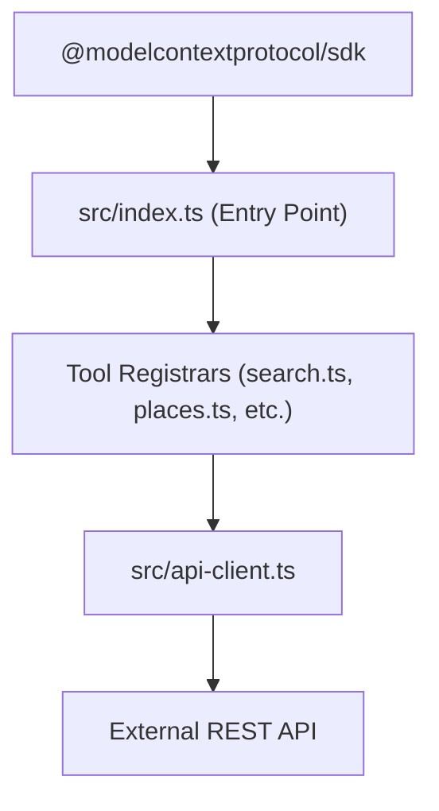

# System Architecture

## System Overview
The MCP server is a Node.js application built using the `@modelcontextprotocol/sdk`. It registers various tools (Search, Places, Announcements, Release Notes) that communicate with the remote `saga-event-space` backend.

## Architecture Diagram

## Component Descriptions
### src/api-client.ts
- **Purpose**: HTTP client for the external API
- **Responsibilities**: Manage authentication tokens, make fetch requests, parse responses, handle errors.
- **Dependencies**: Native `fetch` API.
- **Type**: Client

### src/tools/*
- **Purpose**: MCP Tool definitions
- **Responsibilities**: Register tools with the MCP server, define input schemas using Zod, map inputs to API client calls.
- **Dependencies**: `api-client.ts`, Zod.
- **Type**: Application

## Integration Points
- **External APIs**: Saga Event Space API
