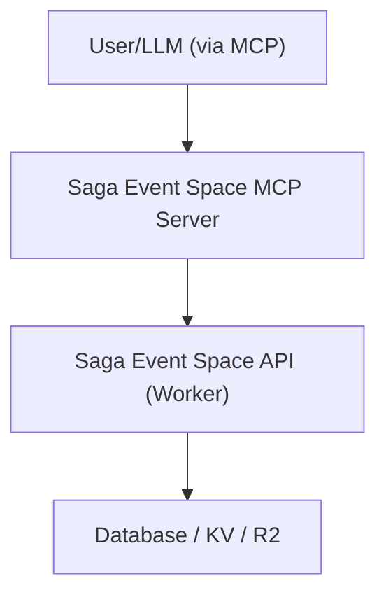

# Business Overview

## Business Context Diagram

## Business Description
- **Business Description**: The system provides an MCP (Model Context Protocol) server that acts as a bridge between LLMs and the Saga Event Space API. It allows AI models to search for and manage event spaces, hotels, and venues in Saga Prefecture.
- **Business Transactions**: 
  - Venue Search & Retrieval
  - Venue Management (Create, Update, Delete)
  - Announcements Management
  - Release Notes Management
- **Business Dictionary**: 
  - MCP: Model Context Protocol
  - Place: Event space, hotel, or venue

## Component Level Business Descriptions
### saga-event-space-mcp-server
- **Purpose**: Provides tools to LLMs via MCP to interact with the Saga Event Space API.
- **Responsibilities**: Translate MCP tool calls into HTTP requests to the Saga Event Space API, handle authentication, and format API responses back to the LLM.
