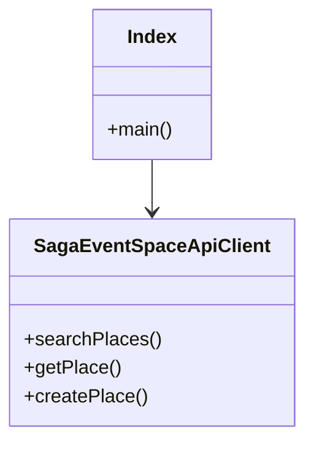

# Code Structure

## Build System
- **Type**: npm + tsc (TypeScript)
- **Configuration**: package.json, tsconfig.json

## Key Classes/Modules

### Existing Files Inventory
- `src/index.ts` - Server entry point, configures MCP server and Stdio transport.
- `src/api-client.ts` - REST API client wrapper.
- `src/types.ts` - TypeScript interfaces matching the external API.
- `src/tools/search.ts` - MCP tools for search.
- `src/tools/places.ts` - MCP tools for places.
- `src/tools/announcements.ts` - MCP tools for announcements.
- `src/tools/release-notes.ts` - MCP tools for release notes.

## Critical Dependencies
### @modelcontextprotocol/sdk
- **Version**: ^1.29.0
- **Usage**: Provides the McpServer and StdioServerTransport classes.
- **Purpose**: Core framework for MCP.

### zod
- **Version**: ^3.24.4
- **Usage**: Used in tool definitions for schema validation.
- **Purpose**: Validate tool inputs.
